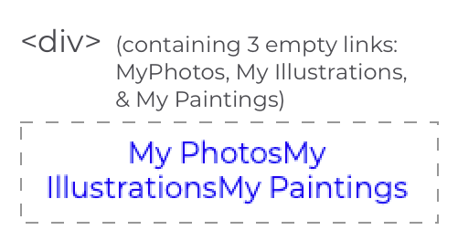
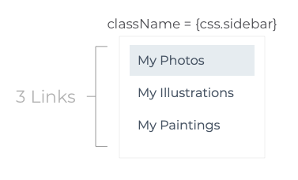

# React Challenges

---
## Using Functional Components Challenge
Use what you've learned in the previous sections to complete the following challenge: 

### Creating Sidebar component with three empty links
**STEPS:**
Note: In the challenge template, React and axios have been pre-installed. You won't be required to run the command
`npx create-react-app my-app --use-npm`.

Follow Step 1 below instead:
1. Inside a folder named **src** you will find a file named **posts.json**, this file is required for later challenges.

2. In the terminal, cd into my-app and install the node packages, `npm install`, and then `npm start` to run your project.

3. Using the existing **Sidebar.js** file, create a functional component, **Sidebar**.
4. Import the component and call on it in your App.js file
5. Test this works with text: "it works!"
6. Replace the "It works!" text with the div tag and 3 empty < a > (as shown above).

Important: Click the hints button below if you get stuck.

Extra Step: You may be wondering why the styling of the 3 links looks a little unusual compared to what you might expect. This is because we've already supplied some CSS files which are already altering the layout of your content.

Take a moment to open the css folder (src > components > css) to review the css files already provided.

---
### Using CSS Modules with React
Use what you've learned in the previous sections to complete the following challenge: 

**STEPS:**
Note: While we won't be covering CSS Modules in React in this part of the course, it will be covered in the walkthrough project, but it's pretty easy to get working so follow these simple steps and you'll have a beautiful looking site in no time!

❗ Important: The convention for naming CSS files linked to specific React components is: **'component.module.css'**, e.g. **Sidebar.module.css**.

As you complete the exercises as you go through this module, you should remember to:
1. Within the component file, import the appropriate css file, e.g. `import css from "./css/Sidebar.module.css"`
2. Add the className to the outermost div in the component file e.g. `< div className = {css.sidebar} >`

Note: After adding our classname and link to the css module, your code output in the preview window should change to look like the example given above.

---
## Learn More:
It's that easy! If you'd like to learn more about adding CSS to a React file, check out:

[Using CSS Modules to style React Components](https://medium.com/@ralph1786/using-css-modules-in-react-app-c2079eadbb87)
[React Documentation: Adding a CSS Modules Stylesheet](https://create-react-app.dev/docs/adding-a-css-modules-stylesheet/)

Extra Step: Open the css folder in the file tree. You can see all of the css files have been completed for you already. It's important to note that we've named our files using a different naming convention e.g. "Sidebar.module.css".

Important: Click the hints button below if you get stuck.

Don’t forget to push your code to github before you continue.